# FTD升版 #

## 升版步驟 ##

**1. 升級前備份設定檔** 

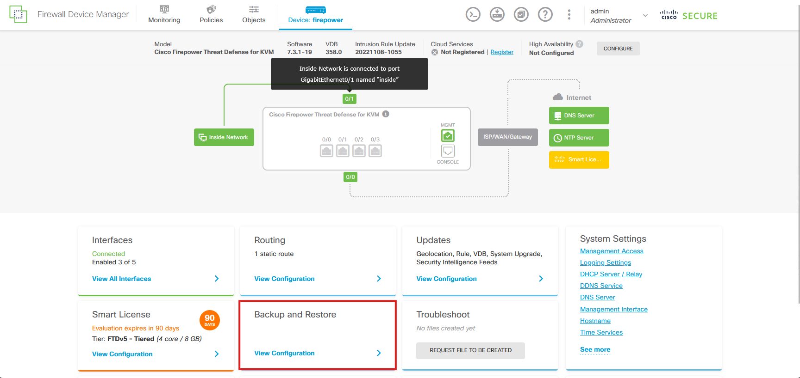

**2. 點選Manual Backup下的Back Up Now**

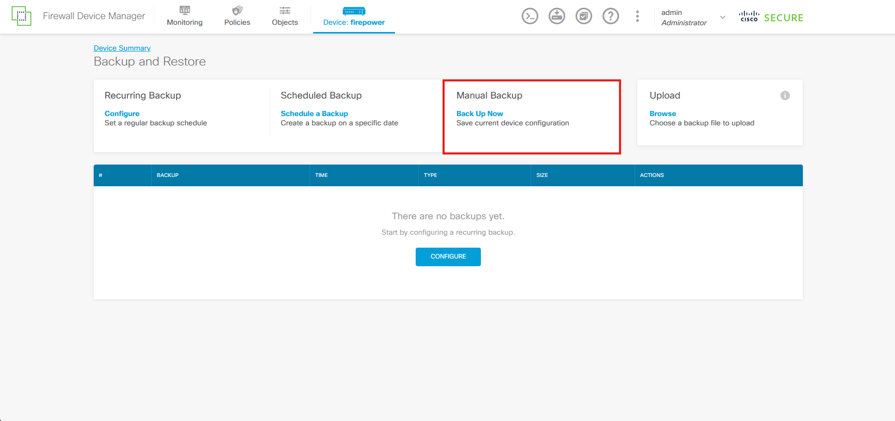

**3. 輸入備份檔案名稱以及選擇是否加密備份檔後，點選BACK UP NOW**

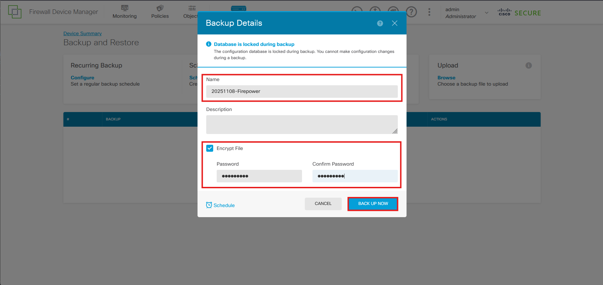

**4. 備份須等1分鐘左右，成功後會出現於下方，記得下載至管理電腦，避免升版後設備故障無法復原**

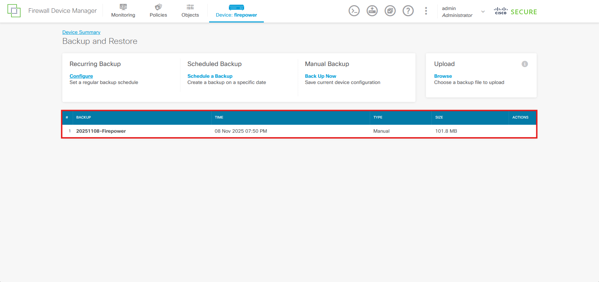

**5. 進入FDM中，選擇Updates** 

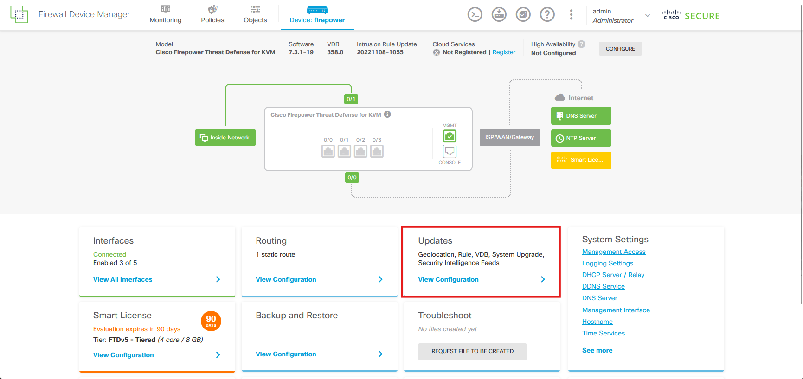

**6. 點選System Upgrade下的BROWSE**

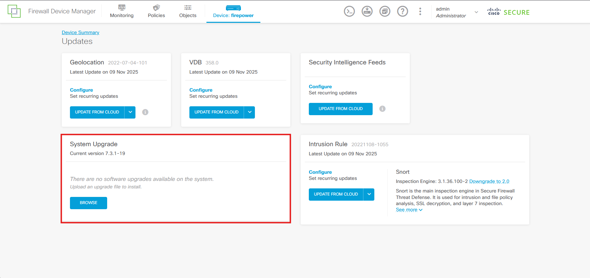 

**7. 選擇新版本檔案** 

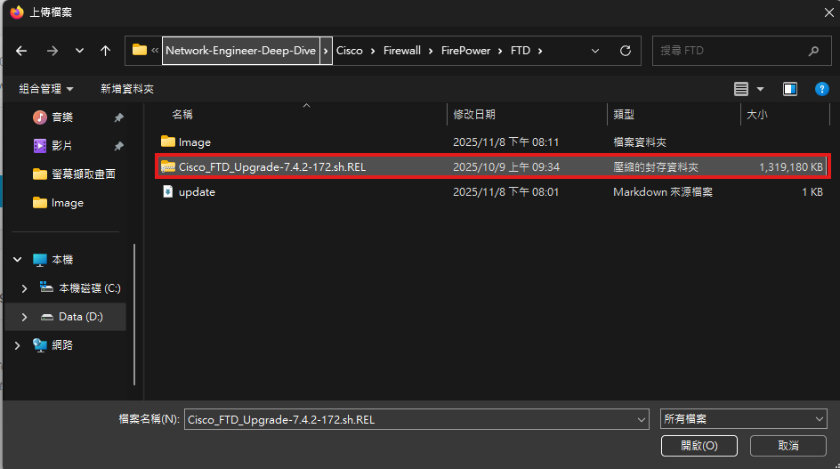

**8. 上傳完成後點選UPGRADE NOW**

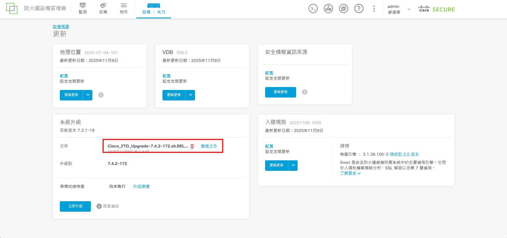

**9. 確定勾選失敗後回滾至前一個版本後Continue**

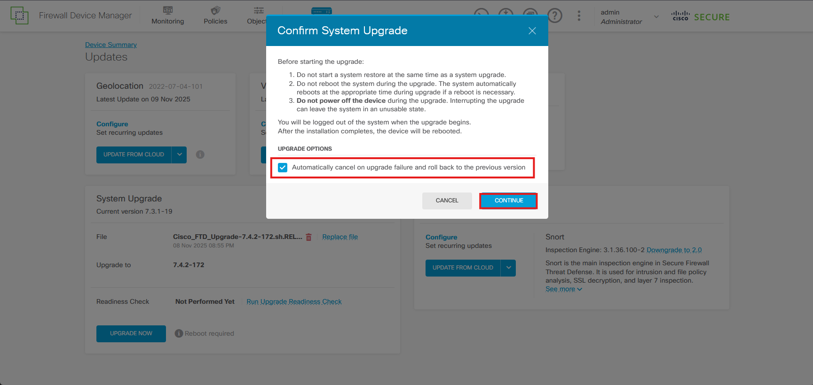

**10. 等待升級安裝完成，至少要半小時至一小時**

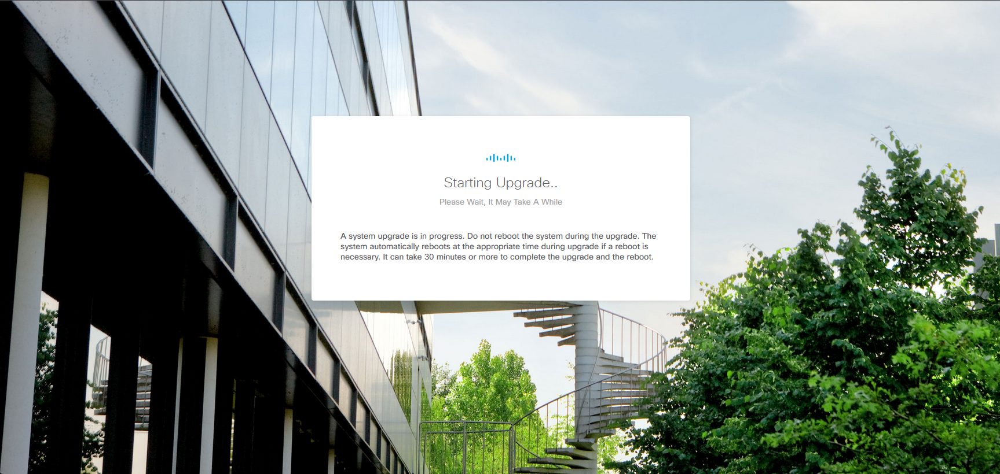

**11. 更新完成**

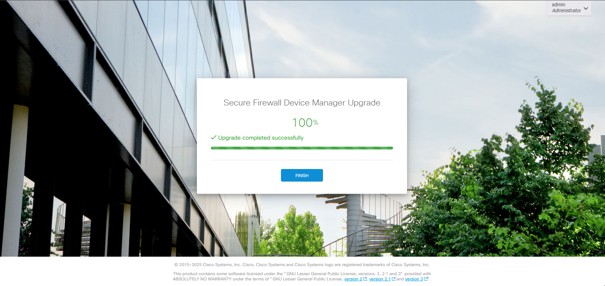