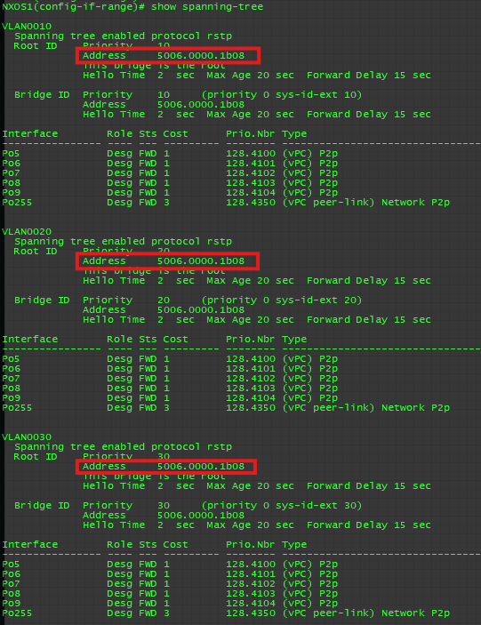
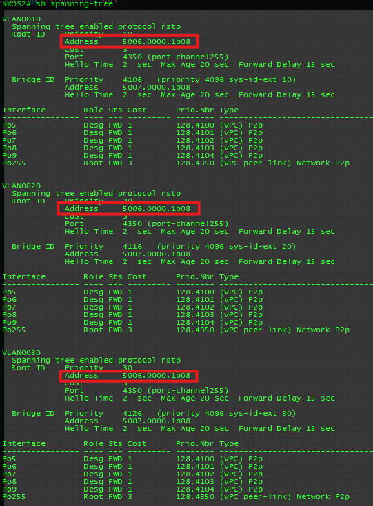
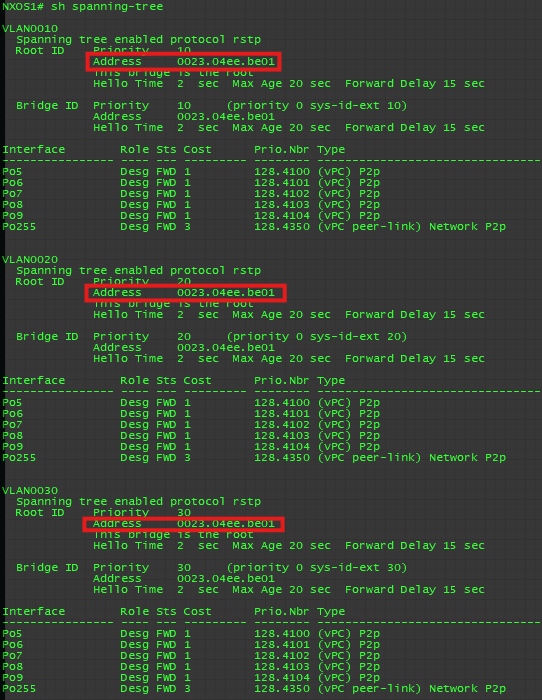
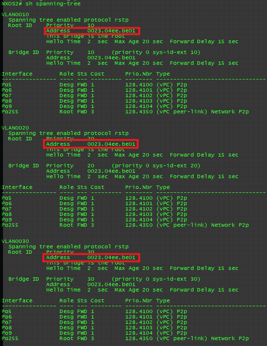

# Virtual Port-Channel(VPC) #

Cisco vPC (Virtual Port Channel) 是 Cisco NX-OS 系統中提供的一種高可用性技術，允許兩台 Nexus 交換機作為一個邏輯單元，實現連接至多個伺服器或其他交換機的多重鏈路聚合。vPC 提供了冗餘性和負載平衡，同時避免了傳統生成樹協議（STP）的限制，減少了封包的轉發延遲。它支持無環路架構，讓流量同時使用多條鏈路，提升了網路的效能與穩定性，是現代數據中心中常見的核心技術之一

## VPC配置順序 ##

1. 配置Peer Keepalive 
2. 建立Peer Keepalive連接
3. 建立Peer link連接
4. 配置上下游交換機的port-channel 


## 實驗 ##

**Topology** 

此拓樸模擬Nexus上游接至Core Switch，下游接至Server，並且都做VPC和LACP的情境

- VLAN 10 192.168.10.0/24 
- VLAN 20 192.168.20.0/24
- VLAN 30 192.168.30.0/24 


## 初始配置 ##

### CoreSW ###

```bash
[CoreSW1]
enable
config t
hostname CoreSW1
vlan 10,20,30
int vlan 10
    ip address 192.168.10.1 255.255.255.0
    no shutdown 
    standby 10 ip 192.168.10.254 
    standby 10 priority 110 
    standby 10 preempt 
int vlan 20
    ip address 192.168.20.1 255.255.255.0
    no shutdown 
    standby 20 ip 192.168.20.254  
    standby 20 preempt 
int vlan 30
    ip address 192.168.30.1 255.255.255.0
    no shutdown 
    standby 30 ip 192.168.30.254 
    standby 30 priority 110 
    standby 30 preempt 
int g0/2
    switchport trunk encapsulation dot1q
    switchport mode trunk 
    no shutdown 
[CoreSW2]
enable 
conf t
hostname CoreSW2
vlan 10,20,30 
int vlan 10
    ip address 192.168.10.2 255.255.255.0
    no shutdown 
    standby 10 ip 192.168.10.254 
    standby 10 preempt 
int vlan 20
    ip address 192.168.20.2 255.255.255.0
    no shutdown 
    standby 20 ip 192.168.20.254  
    standby 20 priority 110 
    standby 20 preempt 
int vlan 30
    ip address 192.168.30.2 255.255.255.0
    no shutdown 
    standby 30 ip 192.168.30.254  
    standby 30 preempt
int g0/2
    switchport trunk encapsulation dot1q
    switchport mode trunk 
    no shutdown 
```

### Nexus ### 

```bash
[NXOS1]
conf t
hostname NXOS1
vlan 10,20,30 
[NXOS2]
conf t
hostname NXOS2
vlan 10,20,30 
```

### Server ###

```bash
#這裡是用Switch模擬下游Server
[Server1]
enable
conf t
hostname Server1
vlan 10,20,30 
int vlan 10 
    ip address 192.168.10.100 255.255.255.0
    no shutdown 
int vlan 20
    ip address 192.168.20.100 255.255.255.0 
    no shutdown 
int vlan 30
    ip address 192.168.30.100 255.255.255.0
    no shutdown 
[Server2]
enable
conf t
hostname Server2
vlan 10,20,30 
int vlan 10 
    ip address 192.168.10.101 255.255.255.0
    no shutdown 
int vlan 20
    ip address 192.168.20.101 255.255.255.0 
    no shutdown 
int vlan 30
    ip address 192.168.30.101 255.255.255.0
    no shutdown 
[Server3]
enable
conf t
hostname Server3
vlan 10,20,30 
int vlan 10 
    ip address 192.168.10.102 255.255.255.0
    no shutdown 
int vlan 20
    ip address 192.168.20.102 255.255.255.0 
    no shutdown 
int vlan 30
    ip address 192.168.30.102 255.255.255.0
    no shutdown 
```

## 配置VPC ##

### Nexus ### 

```bash
[NXOS1]
feature vpc #開啟VPC功能
feature lacp #開啟LACP功能
vrf context keepalive #配置vrf供keepalive使用
spanning-tree vlan 10 priority 0 
int e1/3-4 #要使用Layer 3 Port避免被Block
    no switchport 
    channel-group 254 mode active 
    no shutdown 
int po254 
    vrf member keepalive 
    ip address 192.168.254.1 255.255.255.0 
#配置VPC Domain
vpc domain 1
    peer-keepalive destination 192.168.254.2 source 192.168.254.1 vrf keepalive 
#配置Peer-link 
int e1/1-2 
    switchport 
    switchport mode trunk 
    switchport trunk allowed vlan 10,20,30 
    spanning-tree port type network 
    channel-group 255 mode active 
    no shutdown 
int po255 
    vpc peer-link 
#配置對下游server的port-channel 
int e1/5 
    description connect to CoreSW1
    switchport 
    switchport mode trunk 
    switchport trunk allowed vlan 10,20,30 
    channel-group 5 mode active 
    no shutdown 
int e1/6 
    description connect to CoreSW2
    switchport 
    switchport mode trunk 
    switchport trunk allowed vlan 10,20,30 
    channel-group 6 mode active 
    no shutdown 
int e1/7 
    description connect to Server1
    switchport 
    switchport mode trunk 
    switchport trunk allowed vlan 10,20,30 
    channel-group 7 mode active 
    no shutdown 
int e1/8
    description connect to Server2
    switchport 
    switchport mode trunk 
    switchport trunk allowed vlan 10,20,30 
    channel-group 8 mode active 
    no shutdown 
int e1/9 
    description connect to Server3
    switchport 
    switchport mode trunk 
    switchport trunk allowed vlan 10,20,30 
    channel-group 9 mode active 
    no shutdown 
int po5
    description connect to CoreSW1
    vpc 5
int po6
    description connect to CoreSW2
    vpc 6
int po7 
    description connect to Server1
    vpc 7
int po8
    description connect to Server2
    vpc 8
int po9
    description connect to Server3
    vpc 9
[NXOS2]
feature vpc #開啟VPC功能
feature lacp #開啟LACP功能
vrf context keepalive #配置vrf供keepalive使用
spanning-tree vlan 10 priority 4096 
int e1/3-4 #要使用Layer 3 Port避免被Block
    no switchport 
    channel-group 254 mode active 
    no shutdown 
int po254 
    vrf member keepalive 
    ip address 192.168.254.2 255.255.255.0 
#配置VPC Domain
vpc domain 1
    peer-keepalive destination 192.168.254.1 source 192.168.254.2 vrf keepalive 
#配置Peer-link 
int e1/1-2 
    switchport 
    switchport mode trunk 
    switchport trunk allowed vlan 10,20,30 
    spanning-tree port type network 
    channel-group 255 mode active 
    no shutdown 
int po255 
    vpc peer-link 
#配置對下游server的port-channel 
int e1/5 
    description connect to CoreSW1
    switchport 
    switchport mode trunk 
    switchport trunk allowed vlan 10,20,30 
    channel-group 5 mode active 
    no shutdown 
int e1/6 
    description connect to CoreSW2
    switchport 
    switchport mode trunk 
    switchport trunk allowed vlan 10,20,30 
    channel-group 6 mode active 
    no shutdown 
int e1/7 
    description connect to Server1
    switchport 
    switchport mode trunk 
    switchport trunk allowed vlan 10,20,30 
    channel-group 7 mode active 
    no shutdown 
int e1/8
    description connect to Server2
    switchport 
    switchport mode trunk 
    switchport trunk allowed vlan 10,20,30 
    channel-group 8 mode active 
    no shutdown 
int e1/9 
    description connect to Server3
    switchport 
    switchport mode trunk 
    switchport trunk allowed vlan 10,20,30 
    channel-group 9 mode active 
    no shutdown 
int po5
    description connect to CoreSW1
    vpc 5
int po6
    description connect to CoreSW2
    vpc 6
int po7 
    description connect to Server1
    vpc 7
int po8
    description connect to Server2
    vpc 8
int po9
    description connect to Server3
    vpc 9
```

## 配置上下游的Port-Channel ##

### CoreSW ###

```bash
[CoreSW1]
int range g0/0-1 
    switchport trunk encapsulation dot1q 
    switchport mode trunk
    switchport trunk allowed vlan 10,20,30
    channel-group 5 mode active 
[CoreSW2]
int range g0/0-1 
    switchport trunk encapsulation dot1q 
    switchport mode trunk
    switchport trunk allowed vlan 10,20,30
    channel-group 6 mode active 
```

### Server ###

```bash
[Server1]
int range g0/0-1 
    switchport trunk encapsulation dot1q 
    switchport mode trunk
    switchport trunk allowed vlan 10,20,30
    channel-group 7 mode active 
[Server2]
int range g0/0-1 
    switchport trunk encapsulation dot1q 
    switchport mode trunk
    switchport trunk allowed vlan 10,20,30
    channel-group 8 mode active 
[Server3]
int range g0/0-1 
    switchport trunk encapsulation dot1q 
    switchport mode trunk
    switchport trunk allowed vlan 10,20,30
    channel-group 9 mode active 
```

## 優化設定 ##

### Peer-Switch ###

**開啟Peer-Switch前NXOS1 STP狀態** 



**開啟Peer-Switch前NXOS2 STP狀態** 



**配置Peer-Switch**

```bash
#配置前最好先將上下游的Port-Channel都關閉，避免配置造成flapping
[NXOS1]
int e1/7-9
    shutdown 
vpc domain 1 
    peer-switch 
[NXOS2]
int e1/7-9
    shutdown 
vpc domain 1 
    peer-switch 
```

**開啟Peer-Switch後NXOS1 STP狀態**



**開啟Peer-Switch後NXOS2 STP狀態**

